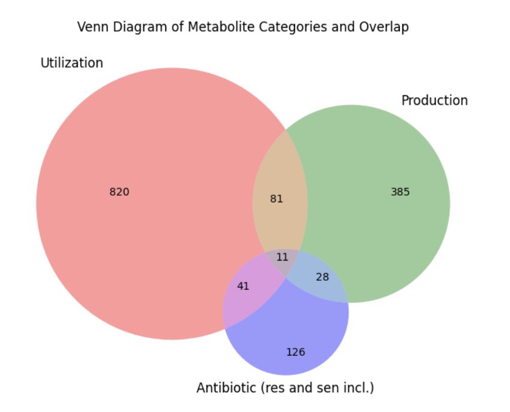

# BacDive Overview

This document provides detailed information about the data available from BacDive, the largest aggregate database for bacterial information. BacDive offers insights into resistance, sensitivity, production, and utilization trends across various bacterial strains, species, and genera.

## Data Categories

1. **Resistance**: Information on bacterial resistance to various metabolites.
2. **Sensitivity**: Data on bacterial sensitivity to specific metabolites.
3. **Production**: Details on metabolites produced by bacteria.
4. **Utilization**: Information on metabolites utilized by bacteria.

## Overview Statistics
As of the date of the pull, there were a total of 31357 unique species. Of these, there were 2422 genera for sole strains, and 592 genera for isolates. There were 1492 unique metabolites for which there were data. 

Only 11 metabolites were tested for all three categories. The largest category by far was utilization.
